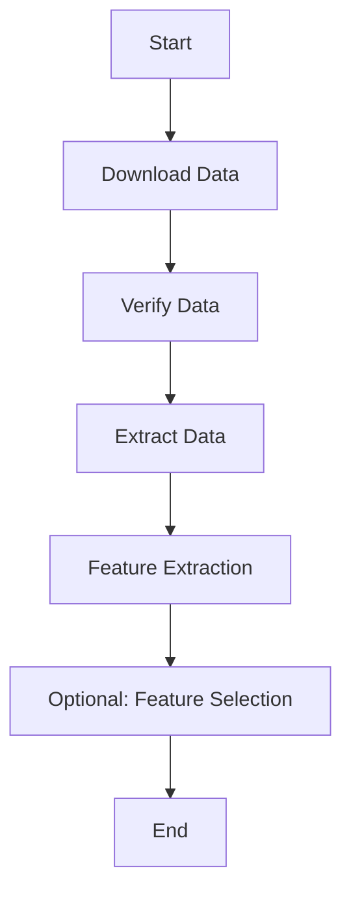

# ML4SEE
Rejecting outliers from captured SEE-transients data @ CERN using ML

In this repository a comprehensive data processing pipeline is designed that allows you to download, verify, extract, and analyze large datasets using the Dask library in Python. It includes a set of scripts that handle data retrieval, integrity verification, feature extraction, and, optionally, feature selection. Dask's dashboard is utilized for real-time monitoring and visualization of task execution and resource utilization. The project aims to provide an efficient and scalable solution for managing and analyzing complex datasets in a parallel and distributed computing environment.

## Summary of scripts
`data_retrieval_download.py`

This Python script is designed to download data files specified in a JSON summary file, providing options to download specific runs and handling failed downloads. It utilizes the Dask library for parallel processing and configuration constants from an external module for flexibility.

`data_retrieval_extract.py`

This Python script is designed to extract files from downloaded tar archives into a specified raw data directory. It provides options to extract files from specific runs and utilizes configuration constants for flexibility. It also leverages Dask for parallel processing.

`data_retrieval_verify.py`

This Python script is designed to verify the integrity of downloaded data files by comparing their MD5 checksums with the values provided in a JSON summary file. It provides options to verify specific runs and handles verification failures, allowing for the deletion of corrupted files. Configuration constants are imported for flexibility, and Dask is used for parallel processing.

`feature_extraction.py`

This Python script performs feature extraction from raw data files and saves the extracted features to CSV files. It utilizes the tsfresh library for feature extraction, Dask for parallel processing, and configuration constants for flexibility.

`feature_selection.py`

This Python script performs feature selection based on relevance analysis using the tsfresh library. It reads feature data from CSV files, drops irrelevant features, and saves the relevance table to a CSV file. Configuration constants are imported for flexibility.

## Processing flow

## Using Dask
Dask is a Python library designed to simplify and parallelize complex computations, especially those involving large datasets. It provides a flexible and easy-to-use interface for parallel and distributed computing, making it easier to scale your data processing tasks from a single machine to a cluster of machines.

Once your script has started, the Dask cluster is running and your Client is connected, you can access the Dask dashboard through a web browser. The default URL is typically http://localhost:8787. You can open this URL in your browser to access the dashboard.

This dashboard provides real-time monitoring and management capabilities for parallel and distributed computing tasks. Users can track task progress, resource utilization, and even dynamically adjust cluster size for optimal performance. It's a vital tool for enhancing the efficiency of computational workloads.